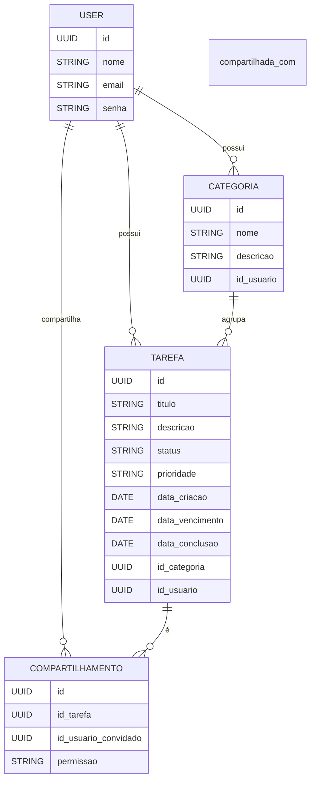

# 📋 TaskMaster API - To-Do List


API REST de gerenciamento de tarefas desenvolvida em **Node.js**, **Express** e **TypeScript**. Permite **criar, listar, atualizar, deletar e filtrar tarefas** de forma **simples+** e **organizada**.

## 🗺️ Índice

- [📋 TaskMaster API - To-Do List](#-taskmaster-api---to-do-list)
- [✨ Funcionalidades](#-funcionalidades)
- [🔧 Tecnologias Utilizadas](#-tecnologias-utilizadas)
- [🗂️ Estrutura de Pastas](#️-estrutura-de-pastas)
- [🏗️ Modelagem Simplificada](#️-modelagem-simplificada)
- [📦 Endpoints da API](#-endpoints-da-api)
- [🎯 Regras de Negócio](#-regras-de-negócio)
- [🛠️ Pré-requisitos](#️-pré-requisitos)
- [🚀 Como usar](#-como-usar)
- [🌍 Acesso à Documentação](#-acesso-à-documentação)
- [🧠 Futuras Melhorias](#-futuras-melhorias-sugestões)
- [👾 Contribua](#-contribua)
- [🧑‍💻 Desenvolvido por](#-desenvolvido-por)


## ✨ Funcionalidades
- ✅ Cadastro e autenticação de usuários (JWT)
- ✅ CRUD de tarefas:
  - Criar tarefa
  - Listar tarefas
  - Buscar tarefa por ID
  - Atualizar tarefa
  - Deletar tarefa
- ✅ Informações de cada tarefa: 
  - 🔑 ID
  - 📝 Título (obrigatório)
  - 🗒️ Descrição (opcional)
  - 🔗 Links relacionados (opcional)
  - 🗓️ Data para conclusão (opcional)
  - ⏳ Status de prazo:
    - No prazo
    - Atrasado (automático, com base na data de conclusão)
  - 🚦 Status da tarefa:
    - Pendente (padrão)
    - Em andamento
    - Concluída
  - 🕒 Data de criação
  - 🔄 Data de atualização
- ✅ CRUD de categorias
- ✅ Status das tarefas (Pendente, Em Andamento, Concluída, Cancelada)
- ✅ Prioridades (Baixa, Média, Alta)
- ✅ Filtros e ordenação
    - Por status (pendente, em andamento, concluída)
    - Por dia, semana, mês ou ano
    - Por data específica ou intervalo de datas
    - Por texto no título ou descrição
- ✅ Compartilhamento de tarefas (bônus!)
- ✅ Documentação automática via Swagger (/docs)

## 🔐 Autenticação
- Cadastro e login de usuário via JWT.
- Cada usuário acessa apenas suas próprias tarefas

## 🔧 Tecnologias Utilizadas
- ⚙️ Backend: Node JS + Express + TypeScript
- 🗄️ Banco de Dados: PostgreSQL + Docker
- 🔐 Autenticação: JWT
- 📄 Documentação: Swagger UI (gerado automaticamente)
- 🚀 Deploy: A definir

## 🗂️ Estrutura de Pastas
```bash
src/  
├── controllers/  
├── models/  
├── routes/  
├── services/  
├── middlewares/  
├── utils/  
├── config/  
├── prisma/  
└── app.ts  
```


## 🏗️ Modelagem Simplificada



## 📦 Endpoints da API
### 🔐 Autenticação
- `POST /auth/register`– Registrar usuário
- `POST /auth/login` – Login

### 📌 Tarefas
- `POST /tasks` – Criar tarefa
- `GET /tasks` – Listar tarefas (com filtros)
- `GET /tasks/{id}` – Buscar tarefa específica
- `PUT /tasks/{id}` – Atualizar tarefa
- `DELETE /tasks/{id}` – Deletar tarefa
- `POST /tasks/{id}/share` – Compartilhar tarefa (bônus)

### 📂 Categorias
- `POST /categories` – Criar categoria
- `GET /categories` – Listar categorias
- `PUT /categories/{id}` – Atualizar categoria
- `DELETE /categories/{id}` – Deletar categoria


## 🎯 Regras de Negócio
- 🔐 Usuário só acessa suas próprias tarefas e categorias.
- ✅ Tarefa marcada como "Concluída" gera data de conclusão automática.
- ❌ Tarefas concluídas não podem ser editadas.
- 🚫 Não pode criar tarefas com vencimento no passado.
- 🔗 Compartilhamento permite outro usuário visualizar ou editar uma tarefa.

## 🛠️ Pré-requisitos
- Node.js (versão 16 ou superior)
- npm ou yarn instalado
- PostgreSQL instalado ou serviço online (ex.: Supabase, Render, Railway...)
- Docker


## 🚀 Como usar

- Clonar o repositório:
```bash
git clone https://github.com/Tatyane-Goncalves/taskMaster_api.git
cd taskMaster_api
```

- Instalar dependências:
```bash
npm install

```

- Crie o arquivo `.env` com as variáveis:
```bash
DATABASE_URL=  
JWT_SECRET=  
PORT=3333 

```

- Rode as migrations 
```bash
npx prisma migrate dev  

```

- Inicie o projeto
```bash
npm run dev  

```

## 🌍 Acesso à Documentação
Quando a API estiver rodando localmente, acesse:

- 👉 http://localhost:3333/docs — Interface Swagger
- 👉 http://localhost:3333/redoc — Interface Redoc

## 🧠 Futuras Melhorias (Sugestões)
- ✅ Recuperação de senha
- ✅ Adicionar prioridade nas tarefas
- ✅ Notificações de prazo
- ✅ Suporte a múltiplos idiomas
- ✅ Deploy na nuvem (Vercel, Railway, Render...)

## 👾 Contribua!
Achou algo que pode melhorar? Vamos codar junto!

- ⚙️ Forka o projeto
- 🚀 Cria sua branch `(feature/nome-da-feature)`
- 🔧 Faz o commit `(git commit -m 'feat: Minha nova feature')`
- 🔥 Push na branch `(git push origin nome-da-branch)`
- ✨ Abre um PR

## 🧑‍💻 Desenvolvido por
**Taty** - Desenvolvedora em formação 🚀